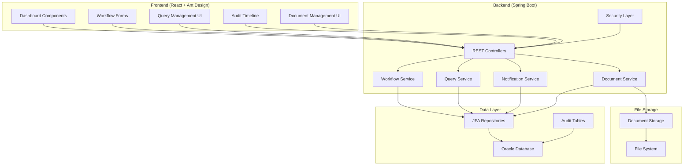
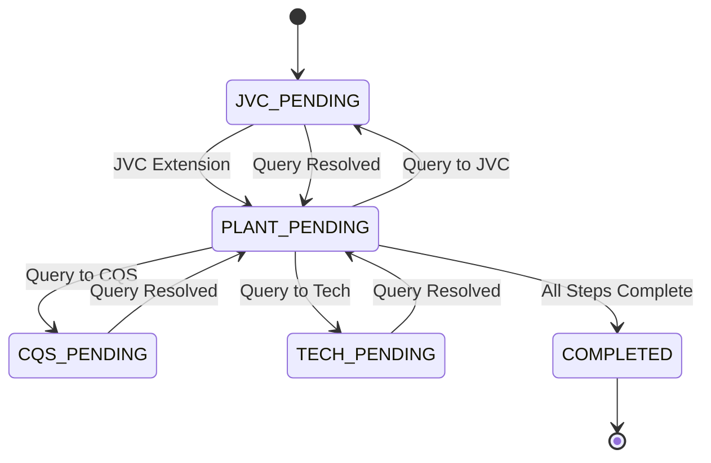
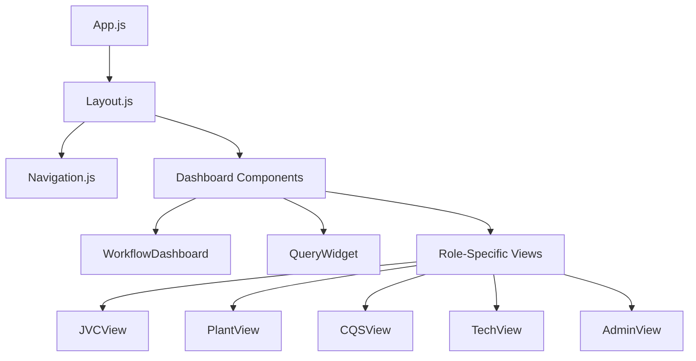

# Design Document

## Overview

The MSDS Workflow Automation system extends the existing QRMFG portal to provide a comprehensive workflow management solution for Material Safety Data Sheet processing across 4 stakeholder teams (JVC, Plant, CQS, Technology). The system leverages the existing Spring Boot + React architecture with Ant Design components, Oracle database, and JWT authentication to create a state-driven workflow engine with role-based access control and document management capabilities.

The design follows a layered architecture pattern with clear separation between presentation, business logic, and data access layers. The workflow engine manages state transitions through a finite state machine pattern, while the query system provides asynchronous communication between teams. The document management system enables file storage, reuse, and secure access across different workflow instances.

## Architecture

### High-Level Architecture



### Workflow State Machine



## Components and Interfaces

### Backend Components

#### 1. Core Entities

**MaterialWorkflow Entity**
```java
@Entity
@Audited
public class MaterialWorkflow {
    @Id
    @GeneratedValue
    private Long id;
    
    private String projectCode;
    private String materialCode;
    private String plantCode;
    private String blockId;
    
    @Enumerated(EnumType.STRING)
    private WorkflowState state;
    
    private String initiatedBy;
    private LocalDateTime createdAt;
    private LocalDateTime lastModified;
    
    @OneToMany(mappedBy = "workflow", cascade = CascadeType.ALL)
    private List<Query> queries;
    
    @OneToMany(mappedBy = "workflow", cascade = CascadeType.ALL)
    private List<QuestionnaireResponse> responses;
    
    @OneToMany(mappedBy = "workflow", cascade = CascadeType.ALL)
    private List<WorkflowDocument> documents;
}
```

**Query Entity**
```java
@Entity
@Audited
public class Query {
    @Id
    @GeneratedValue
    private Long id;
    
    @ManyToOne
    private MaterialWorkflow workflow;
    
    private String question;
    private Integer stepNumber;
    private String fieldName;
    
    @Enumerated(EnumType.STRING)
    private QueryTeam assignedTeam; // CQS, TECH, JVC
    
    @Enumerated(EnumType.STRING)
    private QueryStatus status; // OPEN, RESOLVED
    
    private String response;
    private String raisedBy;
    private String resolvedBy;
    private LocalDateTime createdAt;
    private LocalDateTime resolvedAt;
}
```

**WorkflowDocument Entity**
```java
@Entity
@Audited
public class WorkflowDocument {
    @Id
    @GeneratedValue
    private Long id;
    
    @ManyToOne
    private MaterialWorkflow workflow;
    
    private String fileName;
    private String originalFileName;
    private String filePath;
    private String fileType;
    private Long fileSize;
    private String uploadedBy;
    private LocalDateTime uploadedAt;
    private Boolean isReused;
    private Long originalDocumentId; // Reference to original document if reused
}
```

**QuestionnaireResponse Entity**
```java
@Entity
@Audited
public class QuestionnaireResponse {
    @Id
    @GeneratedValue
    private Long id;
    
    @ManyToOne
    private MaterialWorkflow workflow;
    
    private Integer stepNumber;
    private String fieldName;
    private String fieldValue;
    private LocalDateTime lastModified;
    private String modifiedBy;
}
```

#### 2. Service Layer

**WorkflowService**
- Manages workflow state transitions
- Validates state change permissions
- Triggers notifications on state changes
- Provides workflow status queries

**QueryService**
- Handles query creation and resolution
- Manages query assignments to teams
- Tracks query SLA metrics
- Provides query search and filtering

**NotificationService**
- Sends email/Slack notifications
- Manages notification templates
- Tracks notification delivery status
- Provides notification preferences

**QuestionnaireService**
- Manages dynamic form configurations
- Handles response validation
- Provides progress tracking
- Manages draft saves and auto-recovery

**DocumentService**
- Handles file upload and storage management
- Manages document reuse logic for same project/material combinations
- Provides secure document access and download functionality
- Maintains document metadata and audit trails

**ProjectService**
- Provides project code dropdown data from FSOBJECTREFERENCE (object_type='PROJECT', object_key LIKE 'SER%')
- Manages material code retrieval based on project selection (r_object_type='ITEM', ref_code='SER_PRD_ITEM')
- Handles plant and block code lookups from FSLOCATION (location_code patterns)
- Implements dependent dropdown logic: materials filtered by selected project code
- Integrates with QRMFG_QUESTIONNAIRE_MASTER for questionnaire template population

#### 3. Controller Layer

**WorkflowController**
```java
@RestController
@RequestMapping("/api/workflows")
@PreAuthorize("hasRole('USER')")
public class WorkflowController {
    
    @PostMapping
    @PreAuthorize("hasRole('JVC_USER')")
    public ResponseEntity<MaterialWorkflow> initiateWorkflow(@RequestBody WorkflowRequest request);
    
    @PutMapping("/{id}/extend")
    @PreAuthorize("hasRole('JVC_USER')")
    public ResponseEntity<MaterialWorkflow> extendToPlant(@PathVariable Long id);
    
    @PutMapping("/{id}/complete")
    @PreAuthorize("hasRole('PLANT_USER')")
    public ResponseEntity<MaterialWorkflow> completeWorkflow(@PathVariable Long id);
    
    @GetMapping("/pending")
    public ResponseEntity<List<WorkflowSummary>> getPendingWorkflows();
    
    @GetMapping("/{id}/documents")
    @PreAuthorize("hasRole('PLANT_USER') or hasRole('JVC_USER')")
    public ResponseEntity<List<DocumentSummary>> getWorkflowDocuments(@PathVariable Long id);
    
    @GetMapping("/documents/reusable")
    @PreAuthorize("hasRole('JVC_USER')")
    public ResponseEntity<List<DocumentSummary>> getReusableDocuments(
        @RequestParam String projectCode, @RequestParam String materialCode);
}
```

**ProjectController**
```java
@RestController
@RequestMapping("/api/projects")
@PreAuthorize("hasRole('USER')")
public class ProjectController {
    
    @GetMapping
    public ResponseEntity<List<ProjectOption>> getActiveProjects(); 
    // Query: SELECT DISTINCT object_key as PROJECT_CODE, object_key as label FROM fsobjectreference WHERE object_type='PROJECT' AND object_key LIKE 'SER%'
    
    @GetMapping("/{projectCode}/materials")
    public ResponseEntity<List<MaterialOption>> getMaterialsByProject(@PathVariable String projectCode);
    // Query: SELECT r_object_key as MATERIAL_CODE, r_object_desc as label FROM fsobjectreference 
    // WHERE object_type='PROJECT' AND object_key = :projectCode AND r_object_type='ITEM' AND ref_code='SER_PRD_ITEM'
    
    @GetMapping("/plants")
    public ResponseEntity<List<PlantOption>> getPlantCodes();
    // Query: SELECT location_code as value, location_code as label FROM fslocation WHERE location_code LIKE '1%'
    
    @GetMapping("/plants/{plantCode}/blocks")
    public ResponseEntity<List<BlockOption>> getBlocksByPlant(@PathVariable String plantCode);
    // Query: SELECT location_code as value, location_code as label FROM fslocation WHERE location_code LIKE :plantCode || '%'
}
```

**DocumentController**
```java
@RestController
@RequestMapping("/api/documents")
@PreAuthorize("hasRole('USER')")
public class DocumentController {
    
    @PostMapping("/upload")
    @PreAuthorize("hasRole('JVC_USER')")
    public ResponseEntity<List<DocumentSummary>> uploadDocuments(
        @RequestParam("files") MultipartFile[] files,
        @RequestParam String projectCode,
        @RequestParam String materialCode,
        @RequestParam Long workflowId);
    
    @GetMapping("/{id}/download")
    @PreAuthorize("hasRole('PLANT_USER') or hasRole('JVC_USER')")
    public ResponseEntity<Resource> downloadDocument(@PathVariable Long id);
    
    @PostMapping("/reuse")
    @PreAuthorize("hasRole('JVC_USER')")
    public ResponseEntity<List<DocumentSummary>> reuseDocuments(
        @RequestBody DocumentReuseRequest request);
}
```

**QueryController**
```java
@RestController
@RequestMapping("/api/queries")
@PreAuthorize("hasRole('USER')")
public class QueryController {
    
    @PostMapping
    @PreAuthorize("hasRole('PLANT_USER')")
    public ResponseEntity<Query> raiseQuery(@RequestBody QueryRequest request);
    
    @PutMapping("/{id}/resolve")
    @PreAuthorize("hasRole('CQS_USER') or hasRole('TECH_USER') or hasRole('JVC_USER')")
    public ResponseEntity<Query> resolveQuery(@PathVariable Long id, @RequestBody QueryResponse response);
    
    @GetMapping("/inbox")
    public ResponseEntity<List<Query>> getQueryInbox(@RequestParam String team);
}
```

### Frontend Components

#### 1. Shared Components

**WorkflowDashboard**
- Displays pending tasks panel
- Shows material progress pipeline
- Provides quick action buttons
- Integrates with notification system

**QueryWidget**
- Tabbed interface for different query views
- Real-time query status updates
- Query creation and resolution forms
- Query history and audit trail

#### 2. Role-Specific Components

**JVCWorkflowInitiation**
- Enhanced material extension form with Project Code, Material Code, Plant Code, and Block ID dropdowns
- Dependent dropdown logic (Material depends on Project, Block depends on Plant)
- Multi-file document upload with validation (PDF/DOCX/XLSX, max 25MB)
- Document reuse detection and selection for same project/material combinations
- Workflow extension actions with comprehensive validation

**PlantQuestionnaire**
- Dynamic multi-step form renderer with 10-20 fields grouped in logical steps
- Progress tracking component showing current step (e.g., Step 3/10)
- Query raising modal with team selection (CQS/Tech/JVC) and field context
- Draft save functionality with auto-recovery
- Context panel displaying JVC-provided material data and uploaded documents
- Document download functionality for JVC-uploaded files

**QueryInbox**
- Filterable query table
- Query detail modal
- Response editor with rich text
- SLA tracking indicators

**AuditTimeline**
- Chronological event display
- State transition visualization
- User action tracking
- Export functionality

#### 3. UI Component Architecture



## Data Models

### Database Schema

```sql
-- Workflow Management Tables
CREATE TABLE material_workflows (
    id NUMBER PRIMARY KEY,
    project_code VARCHAR2(50) NOT NULL,
    material_code VARCHAR2(50) NOT NULL,
    plant_code VARCHAR2(50) NOT NULL,
    block_id VARCHAR2(50) NOT NULL,
    state VARCHAR2(20) NOT NULL,
    initiated_by VARCHAR2(100),
    created_at TIMESTAMP DEFAULT CURRENT_TIMESTAMP,
    last_modified TIMESTAMP DEFAULT CURRENT_TIMESTAMP,
    UNIQUE(project_code, material_code, plant_code, block_id)
);

CREATE TABLE queries (
    id NUMBER PRIMARY KEY,
    workflow_id NUMBER REFERENCES material_workflows(id),
    question CLOB NOT NULL,
    step_number NUMBER,
    field_name VARCHAR2(100),
    assigned_team VARCHAR2(20) NOT NULL, -- CQS, TECH, JVC
    status VARCHAR2(20) DEFAULT 'OPEN',
    response CLOB,
    raised_by VARCHAR2(100),
    resolved_by VARCHAR2(100),
    created_at TIMESTAMP DEFAULT CURRENT_TIMESTAMP,
    resolved_at TIMESTAMP
);

CREATE TABLE questionnaire_responses (
    id NUMBER PRIMARY KEY,
    workflow_id NUMBER REFERENCES material_workflows(id),
    step_number NUMBER NOT NULL,
    field_name VARCHAR2(100) NOT NULL,
    field_value CLOB,
    last_modified TIMESTAMP DEFAULT CURRENT_TIMESTAMP,
    modified_by VARCHAR2(100)
);

CREATE TABLE workflow_documents (
    id NUMBER PRIMARY KEY,
    workflow_id NUMBER REFERENCES material_workflows(id),
    file_name VARCHAR2(255) NOT NULL,
    original_file_name VARCHAR2(255) NOT NULL,
    file_path VARCHAR2(500) NOT NULL,
    file_type VARCHAR2(10) NOT NULL,
    file_size NUMBER NOT NULL,
    uploaded_by VARCHAR2(100),
    uploaded_at TIMESTAMP DEFAULT CURRENT_TIMESTAMP,
    is_reused NUMBER(1) DEFAULT 0,
    original_document_id NUMBER REFERENCES workflow_documents(id)
);

-- Reference Tables (existing in system)
-- FSOBJECTREFERENCE - contains project and material relationships
--   Structure: object_type, object_key (PROJECT_CODE), r_object_type, r_object_key (MATERIAL_CODE), r_object_desc, ref_code
--   Example: PROJECT 'SER-A-000210' -> ITEM 'R31516J' with ref_code 'SER_PRD_ITEM'
-- FSLOCATION - contains location codes
--   Structure: location_code (plant codes like '1%' pattern)
-- QRMFG_QUESTIONNAIRE_MASTER - contains questionnaire master templates

-- Sample Queries for Reference:
-- Projects and Materials:
-- SELECT object_type, object_key as PROJECT_CODE, r_object_type, r_object_key as MATERIAL_CODE, r_object_desc, ref_code 
-- FROM fsobjectreference 
-- WHERE object_type='PROJECT' AND object_key LIKE 'SER%' AND r_object_type='ITEM' AND r_object_key LIKE 'R%' AND ref_code='SER_PRD_ITEM'

-- Plant Codes:
-- SELECT location_code FROM fslocation WHERE location_code LIKE '1%'

-- Audit Tables (Hibernate Envers)
CREATE TABLE material_workflows_aud (
    id NUMBER,
    rev NUMBER,
    revtype NUMBER,
    project_code VARCHAR2(50),
    material_code VARCHAR2(50),
    plant_code VARCHAR2(50),
    block_id VARCHAR2(50),
    state VARCHAR2(20),
    initiated_by VARCHAR2(100),
    created_at TIMESTAMP,
    last_modified TIMESTAMP
);

CREATE TABLE workflow_documents_aud (
    id NUMBER,
    rev NUMBER,
    revtype NUMBER,
    workflow_id NUMBER,
    file_name VARCHAR2(255),
    original_file_name VARCHAR2(255),
    file_path VARCHAR2(500),
    file_type VARCHAR2(10),
    file_size NUMBER,
    uploaded_by VARCHAR2(100),
    uploaded_at TIMESTAMP,
    is_reused NUMBER(1),
    original_document_id NUMBER
);
```

### API Data Transfer Objects

**WorkflowSummary DTO**
```java
public class WorkflowSummary {
    private Long id;
    private String projectCode;
    private String materialCode;
    private String plantCode;
    private String blockId;
    private WorkflowState currentState;
    private String actionRequiredBy;
    private Integer daysPending;
    private Integer totalQueries;
    private Integer openQueries;
    private Integer documentCount;
}
```

**QuerySummary DTO**
```java
public class QuerySummary {
    private Long id;
    private String projectCode;
    private String materialCode;
    private String plantCode;
    private Integer stepNumber;
    private String question;
    private Integer daysOpen;
    private QueryTeam assignedTeam;
    private QueryStatus status;
}
```

**DocumentSummary DTO**
```java
public class DocumentSummary {
    private Long id;
    private String fileName;
    private String originalFileName;
    private String fileType;
    private Long fileSize;
    private String uploadedBy;
    private LocalDateTime uploadedAt;
    private Boolean isReused;
    private String downloadUrl;
}
```

**ProjectOption DTO**
```java
public class ProjectOption {
    private String value; // object_key (e.g., "SER-A-000210")
    private String label; // object_key (same as value for display)
}
```

**MaterialOption DTO**
```java
public class MaterialOption {
    private String value; // r_object_key (e.g., "R31516J")
    private String label; // r_object_desc (e.g., "Axion CS 2455 (DBTO)")
    private String projectCode; // object_key (parent project)
}
```

**PlantOption DTO**
```java
public class PlantOption {
    private String value; // location_code (e.g., "1001")
    private String label; // location_code (same as value for display)
}
```

**BlockOption DTO**
```java
public class BlockOption {
    private String value; // location_code (e.g., "1001-A")
    private String label; // location_code (same as value for display)
    private String plantCode; // parent plant code
}
```

## Error Handling

### Exception Hierarchy

```java
@ResponseStatus(HttpStatus.BAD_REQUEST)
public class InvalidWorkflowStateException extends RuntimeException {
    public InvalidWorkflowStateException(String message) {
        super(message);
    }
}

@ResponseStatus(HttpStatus.FORBIDDEN)
public class UnauthorizedWorkflowActionException extends RuntimeException {
    public UnauthorizedWorkflowActionException(String message) {
        super(message);
    }
}

@ResponseStatus(HttpStatus.NOT_FOUND)
public class WorkflowNotFoundException extends RuntimeException {
    public WorkflowNotFoundException(String materialId) {
        super("Workflow not found for material: " + materialId);
    }
}
```

### Global Exception Handler

```java
@ControllerAdvice
public class WorkflowExceptionHandler {
    
    @ExceptionHandler(InvalidWorkflowStateException.class)
    public ResponseEntity<ErrorResponse> handleInvalidState(InvalidWorkflowStateException ex) {
        return ResponseEntity.badRequest()
            .body(new ErrorResponse("INVALID_STATE", ex.getMessage()));
    }
    
    @ExceptionHandler(UnauthorizedWorkflowActionException.class)
    public ResponseEntity<ErrorResponse> handleUnauthorized(UnauthorizedWorkflowActionException ex) {
        return ResponseEntity.status(HttpStatus.FORBIDDEN)
            .body(new ErrorResponse("UNAUTHORIZED", ex.getMessage()));
    }
}
```

### Frontend Error Handling

- Global error boundary for React components
- Ant Design notification system for user feedback
- Retry mechanisms for failed API calls
- Offline state detection and queuing

## Testing Strategy

### Backend Testing

**Unit Tests**
- Service layer business logic validation
- State transition logic verification
- Query assignment and resolution logic
- Notification trigger conditions

**Integration Tests**
- REST API endpoint testing
- Database transaction verification
- Security role-based access testing
- Workflow state persistence testing

**Test Configuration**
```java
@SpringBootTest
@TestPropertySource(locations = "classpath:application-test.properties")
@Transactional
public class WorkflowServiceIntegrationTest {
    
    @Autowired
    private WorkflowService workflowService;
    
    @Test
    public void testWorkflowStateTransition() {
        // Test implementation
    }
}
```

### Frontend Testing

**Component Tests**
- React component rendering verification
- User interaction simulation
- Form validation testing
- State management verification

**Integration Tests**
- API integration testing
- Authentication flow testing
- Role-based UI rendering
- Notification system testing

**E2E Tests**
- Complete workflow execution
- Multi-user collaboration scenarios
- Query resolution workflows
- Mobile responsiveness testing

### Performance Testing

**Load Testing**
- Concurrent user simulation
- Database query optimization
- API response time measurement
- Memory usage profiling

**Scalability Testing**
- Large dataset handling
- Concurrent workflow processing
- Query system performance
- Notification system throughput

## Security Considerations

### Authentication & Authorization

- JWT token-based authentication (existing)
- Role-based access control with method-level security
- API endpoint protection based on user roles
- Session management and token refresh

### Data Protection

- Sensitive data encryption at rest
- HTTPS enforcement for all communications
- Input validation and sanitization
- SQL injection prevention through JPA

### Audit & Compliance

- Complete audit trail using Hibernate Envers
- User action logging with timestamps
- Data retention policies
- Export capabilities for compliance reporting

## Deployment Architecture

### Environment Configuration

**Development**
- Local Oracle database
- Hot reload for frontend development
- Debug logging enabled
- Mock notification services

**Production**
- Oracle RAC for high availability
- Load balancer for frontend
- Centralized logging with ELK stack
- Email/Slack integration for notifications

### Monitoring & Observability

- Application metrics with Micrometer
- Database performance monitoring
- API response time tracking
- User activity analytics
- Error rate monitoring and alerting